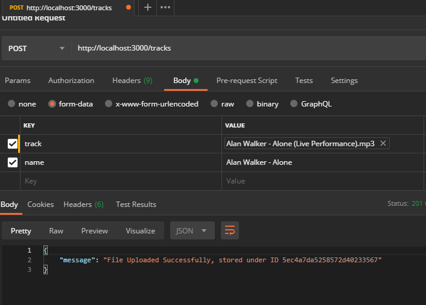
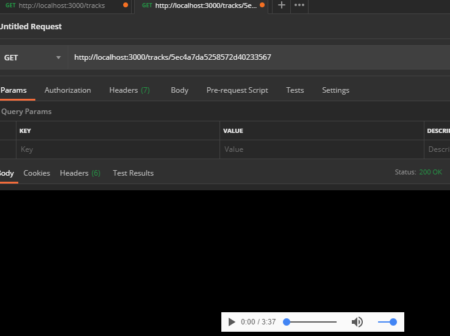

# Proyecto practico con node y Modulo Stream
    Proyecto practico el cual consiste el la subida de archivos de
    musica utilizando el modulo Stream y guardandolo en MongoDB.

## Como correr el proyecto
    1. `npm i`
    2. `npm start`

## Como probarla
1. La app cuenta con solo dos rutas
    * post->enviar audio
    * get->traer audio

2. Abrir Postman

3. Para registrar agregar key y value
    * key-> track y name

4. Para traer audio
   * Cuando se registra la cancion se crea un ID copiarlo y pegar como muestra la imagen

### NOTE: Tamaño maximo del archivo 6 mb

 * Ver curso: [Nodejs, Subida de Audio y modulo Stream](https://www.youtube.com/watch?v=lSCLVwLdSOk)